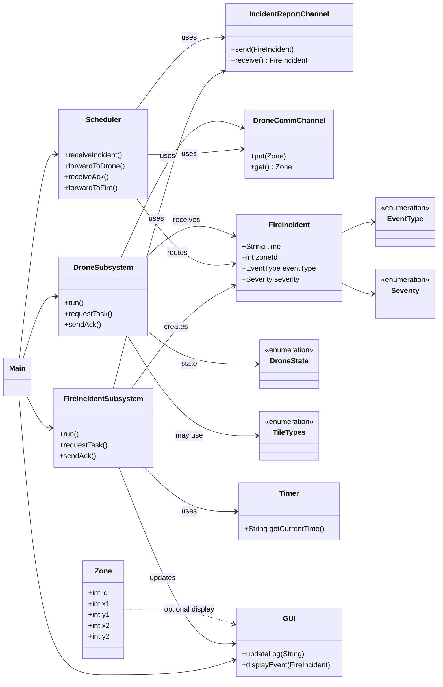
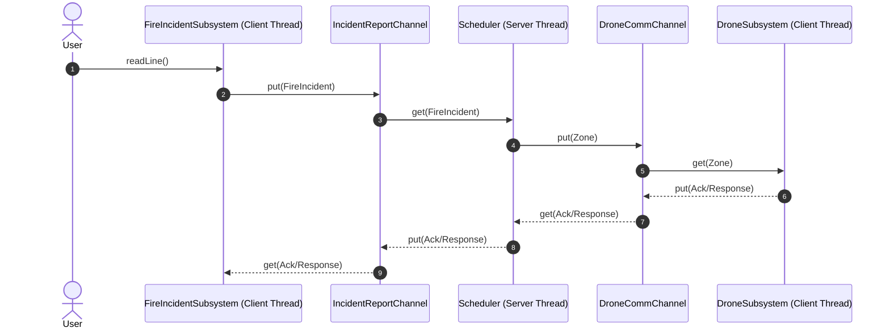
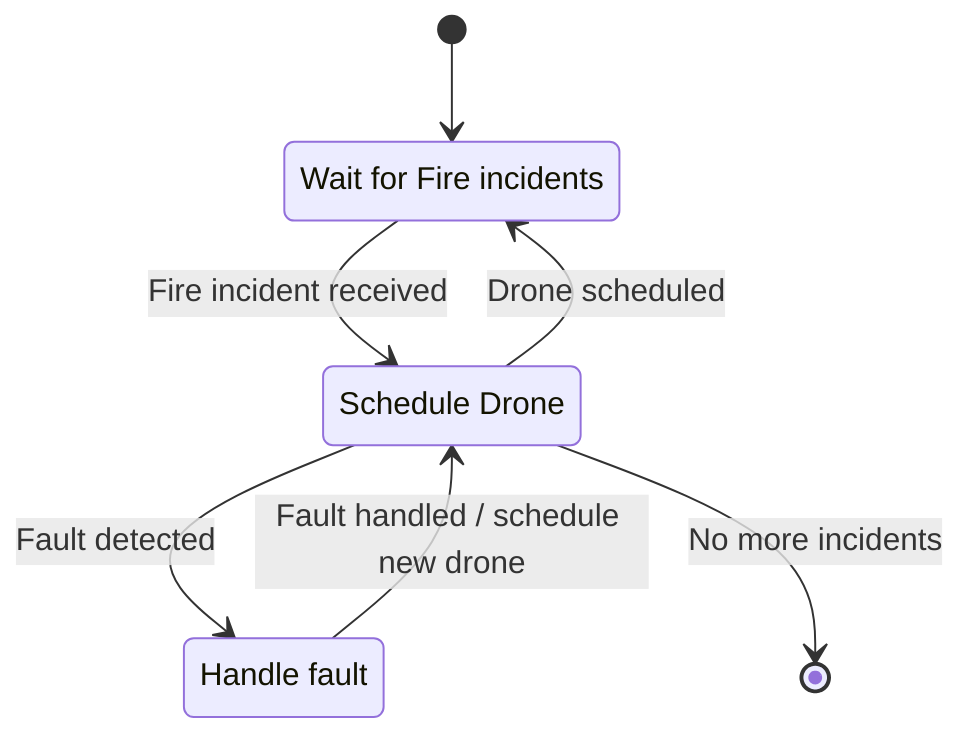
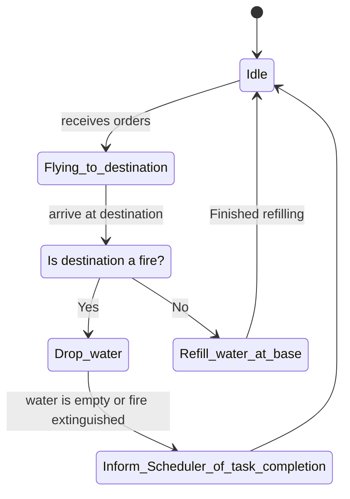

# FIREFIGHTING DRONE SWARM (RTCS - SIM)
_SYSC3303 - A3G6 • Winter 2026 • Dr. Sabouni, Rami • Carleton University (FED - SCE)_

## 1. OVERVIEW
This Real-Time Control System (RTCS) simulates a firefighting drone swarm composed of three cooperating subsystems running within a single JVM for Iteration 2:
1. Scheduler
2. Drone Subsystem
3. Fire Incident Subsystem

In Iteration 2, each component executes as a dedicated thread within a single JVM, coordinating fire events, drone state machines, and real‑time actions such as travel and agent release via synchronized in‑memory channels (`put`/`get`). A distributed, multi‑process deployment over UDP is planned for Iteration 3.

## 2. Features
- [x] Iteration 1: Basic message passing between subsystems using threaded communication.
- [x] Iteration 2: Core scheduling logic and complete drone state machine implementation.
- [ ] Iteration 3: Multi‑drone support with distributed execution over UDP.
- [ ] Iteration 4: Fault injection, detection, and automated fault handling.
- [ ] Iteration 5: Full real‑time visualization, capacity limits, and system performance metrics.

## 3. System Architecture
### 3.1 Components and Connectors (C&C)
Planned Iteration 3+ package refactor: each subsystem will be isolated into its own package, communicate through defined channels, and be developed and tested independently:
```
  fire/               # Fire Incident Subsystem
   │    ├── FireIncident.java
   │    ├── FireIncidentSubsystem.java
   │    └── EventType.java
   │
  scheduler/          # Scheduler core + scheduling state machine
   │    ├── Scheduler.java
   │    ├── SchedulingState.java
   │    └── FaultTypes.java
   │
  drone/              # Drone Subsystem & drone state logic
   │    ├── DroneSubsystem.java
   │    ├── DroneState.java
   │    ├── DroneTask.java
   │    ├── DroneStatusUpdate.java
   │    └── TileTypes.java
   │
  channels/           # Communication channels between subsystems
   │    ├── IncidentReportChannel.java
   │    ├── DroneCommChannel.java
   │    └── DroneStatusChannel.java
   │
  model/              # Shared domain models & utilities
   │    ├── Severity.java
   │    ├── Zone.java
   │    └── Timer.java
   │
  ui/                 # User Interface components
   │    └── GUI.java
   │
  Main.java           # Application entry point
```
**Note** on Iteration 2 - 3 Transition:

_In Iteration 2, all Java sources currently reside under `src/main/java/org/example`, and some of the classes/packages shown in the tree above (e.g., `DroneStatusChannel`, `DroneTask`, `DroneStatusUpdate`) are not yet implemented. The tree represents the **target** package layout for Iteration 3+ when the system transitions from thread‑based communication to fully distributed processes using UDP; any structural misalignments will be resolved as part of that architectural refactoring._

### 3.2. UML Diagrams
#### Class Diagram
##### Iteration 2

#### Messages Sequence Diagram

#### Scheduler State Machine

#### Drone State Machine

### 3.3. Design Summary (Iteration 2)
Iteration 2 expands the system from simple message‑passing to coordinated control:
- The Scheduler uses a state machine to receive incidents, assign tasks to drones, and handle faults.
- The Drone Subsystem executes missions through its own state machine, managing navigation, water dropping, refilling, and completion reporting.
- The Fire Incident Subsystem streams timed events into the system and receives acknowledgements after tasks are completed.
- Communication remains decoupled through dedicated channel classes, ensuring each subsystem can be tested in isolation.
- This architecture provides the groundwork required for multi‑drone coordination, distributed execution, and error handling in future iterations.
## 4. Installation & Setup
### 4.1. Requirements
- [x] Java 17 or later
- [ ] IntelliJ IDEA (recommended)
- [ ] Git (optional, for pulling updates)
### 4.2. Getting the Project
Clone or download the repository:
```Shell
git clone <your-repo-url>
cd <project-folder>
```
_Or download the ZIP and extract it._
### 4.3. Opening in IntelliJ
1. Open IntelliJ IDEA
2. Select `File` → `Open`
3. Choose the project root folder
4. Allow IntelliJ to index and load dependencies
### 4.4. Building the Project
If using IntelliJ, the project builds automatically.
Using the terminal:
```Shell
# For Maven
mvn clean compile
```
_Use whichever build tool you configured._
### 4.5. Running the Simulation
1. Locate the Main class in src/main/java/org/example
2. Run it using `Run` → `Run 'Main'` in IntelliJ
3. Load your event and zone files when prompted or via configuration
## 5. Input Files
The simulation uses two input files to drive events and define the environment:
### 5.1. Event File (CSV)
Each line represents a time‑stamped fire‑related event:

`hh:mm:ss.mmm, zoneId, FIRE_DETECTED | DRONE_REQUEST, Low | Moderate | High`

Example: `14:03:15.000, 3, FIRE_DETECTED, High`
### 5.2. Zone File (CSV)
Defines rectangular fire zones by their coordinate bounds:
`zoneId, (x1,y1), (x2,y2)`

Example: `3, (700,600), (1200,1200)`

Severity values map to the amount of agent required.
## 6. Configuration
Simulation parameters are configurable through code constants or optional configuration files:
- Number of drones
- Number of zones
- Travel time between zones
- Agent drop time
- Nozzle open/close time
- Initial agent capacity per drone
- Paths to event and zone input files
Future iterations (Iteration 3+) will extend configuration to include:
- UDP ports per subsystem
- Per‑drone task/status sockets
- Fault injection options
## 7. System Behavior
The system follows a modular, message‑driven model in which each subsystem executes independently:
### 7.1. Fire Incident Subsystem
1. Reads and parses fire events from the input file
2. Publishes incidents to the Scheduler over the report channel
3. Receives acknowledgements after drone completion
### 7.2. Scheduler
1. Maintains the incident queue
2. Assigns tasks to available drones following scheduling rules
3. Forwards incidents and receives drone updates
4. Handles faults (Iteration 2 foundational logic in place)
### 7.3. Drone Subsystem
1. Executes a state machine: Idle → Flying → Drop Water → Inform Scheduler → Refill → Idle
2. Reports status and completion
3. Decides whether to refill or accept additional tasks

## 8. Current Iteration Status
- Iteration 0 → Collected real‑world drone parameters (travel times, drop rates, payload capacity) and established baseline timing assumptions for the simulation.
- Iteration 1 → Focused on creating basic communication between the subsystems using threads. Verified that messages can be read, transmitted, forwarded, and returned correctly across the Fire Incident Subsystem, Scheduler, and Drone Subsystem.
- Iteration 2 → Implemented core scheduling logic, introduced the full drone state machine (idle, navigating, dropping, refilling), added real‑time behaviour for travel and agent consumption, refined the subsystem interaction model, and updated the GUI to display drone state and incident activity.
## 9. Testing
V&V covers both implemented tests and recommended coverage needed for Iteration 2 and beyond.
### 9.1. Planned / Intended Tests (not yet implemented)
At present, the only test artifact in `src/test/java` is an empty `GUItests.java` stub; the following tests are **planned** as part of the V&V strategy but are **not yet implemented** in this repository:
- [ ] GUI tests
- [ ] Channel tests: IncidentReportChannelTest, DroneStatusChannelTest
- [ ] Subsystem tests: FireIncidentSubsystemTest, DroneSubsystemTest, SchedulerTest
- [ ] Integration test: end‑to‑end message‑passing validation
- [ ] Stub GUI used to isolate UI from subsystem logic and sample input files included for reproducible tests
### 9.2. Recommended V&V Suite Additions
To fully verify Iteration 2 behaviour:
#### Unit Tests
1. Event file parsing (timestamp, zone, severity)
2. Zone file parsing
3. Drone state machine transitions (including edge cases)
4. Scheduler scheduling order (FIFO arrival order)
5. Agent depletion and refill logic
6. Timing behaviour using a deterministic test clock
#### Integration Tests
7. End‑to‑end incident → scheduler → drone → scheduler → acknowledgement
8. Handling multiple queued incidents with one drone
9. GUI model updates triggered by subsystem events
#### Future V&V (Iteration 3+)
10. Multi‑drone assignment fairness
11. UDP packet construction and decoding
12. Timeout handling for missing drone updates
13. Recovery from faults and reassignment logic
## 10. Team Responsibilities
- Pietro Adamvoski: Fire incident subsystem, and Scheduler subsystem.
- Avery Robertson: GUI, Drone subsystem, and communication between threads, Iteration02 UMLs and SM Diagrams.
- Adam Haddadin: Iteration 01 UMLs and `README.txt`, initial Test Suites, bug fixes.
- Fareen Lavji: Elicitation of V&V Requirements and Test Suite Package, Draft Architecture Packages for Iteration 03, Iteration 02 `README.MD`, Iteration 03 UMLs and SM Diagrams.
