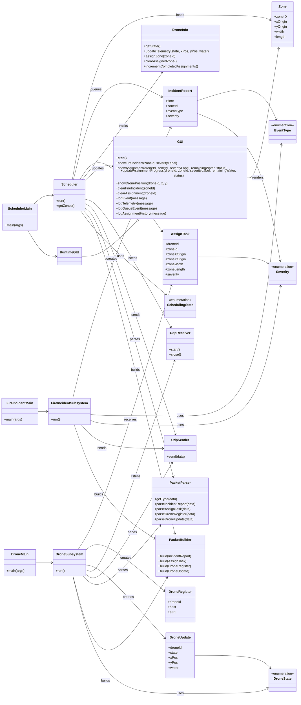
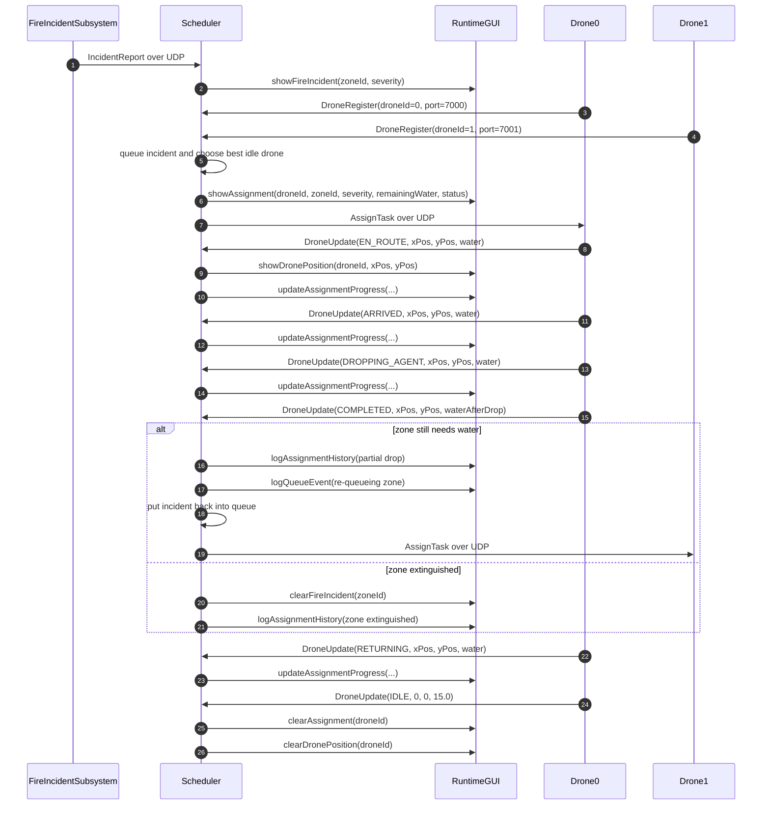
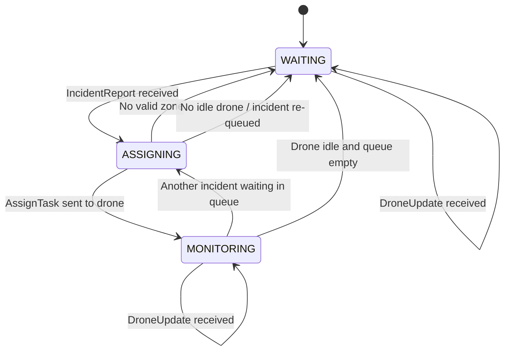
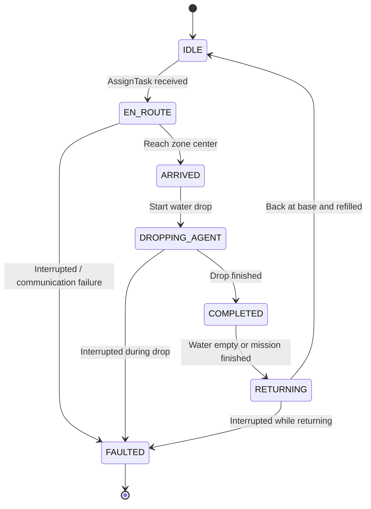

# FIREFIGHTING DRONE SWARM — Iteration 03

## Firefighting Drone Swarm Simulation

This is our Iteration 3 submission for the SYSC3303 firefighting drone project.

The system is split into three subsystems that run separately:

- Scheduler
- Fire Incident Subsystem
- Drone Subsystem

The Scheduler receives incidents, assigns drones, and updates the GUI. The Fire Incident Subsystem reads the event CSV and sends requests to the Scheduler. Each drone runs in its own process and reports its state back while it moves, drops water, and returns.

## Main files

### Entry points
- `src/main/java/DroneSwarmSim/scheduler/SchedulerMain.java`
  - Starts the Scheduler and opens the runtime GUI.
- `src/main/java/DroneSwarmSim/fire/FireIncidentMain.java`
  - Starts the Fire Incident Subsystem.
- `src/main/java/DroneSwarmSim/drone/DroneMain.java`
  - Starts one drone process.

### Core subsystem files
- `src/main/java/DroneSwarmSim/scheduler/Scheduler.java`
  - Handles incidents, drone registration, assignments, and updates.
- `src/main/java/DroneSwarmSim/fire/FireIncidentSubsystem.java`
  - Reads the event file and sends incidents over UDP.
- `src/main/java/DroneSwarmSim/drone/DroneSubsystem.java`
  - Simulates drone movement, water dropping, and return to base.

### GUI files
- `src/main/java/DroneSwarmSim/ui/GUI.java`
- `src/main/java/DroneSwarmSim/ui/RuntimeGUI.java`
- `src/main/java/DroneSwarmSim/ui/TileTypes.java`

### Shared models and messages
- `src/main/java/DroneSwarmSim/model/Zone.java`
- `src/main/java/DroneSwarmSim/model/Severity.java`
- `src/main/java/DroneSwarmSim/messaging/IncidentReport.java`
- `src/main/java/DroneSwarmSim/messaging/AssignTask.java`
- `src/main/java/DroneSwarmSim/messaging/DroneRegister.java`
- `src/main/java/DroneSwarmSim/messaging/DroneUpdate.java`

### UDP support
- `src/main/java/DroneSwarmSim/net/udp/UdpEndpoint.java`
- `src/main/java/DroneSwarmSim/net/udp/UdpSender.java`
- `src/main/java/DroneSwarmSim/net/udp/UdpReceiver.java`
- `src/main/java/DroneSwarmSim/net/udp/PacketBuilder.java`
- `src/main/java/DroneSwarmSim/net/udp/PacketParser.java`

### Configuration files
- `src/main/java/DroneSwarmSim/config/SchedulerConfig.java`
- `src/main/java/DroneSwarmSim/config/FireIncidentConfig.java`
- `src/main/java/DroneSwarmSim/config/DroneConfig.java`

### Input files
- `Sample_event_file.csv`
  - Default incident file for the Iteration 3 demo.
- `sample_zone_file.csv`
  - Default zone file for the Iteration 3 demo.

### Test files
- `src/test/java/DroneSwarmSim/net/udp/PacketRoundTripTest.java`
- `src/test/java/DroneSwarmSim/fire/FireIncidentSubsystemTest.java`
- `src/test/java/DroneSwarmSim/scheduler/SchedulerTest.java`
- `src/test/java/DroneSwarmSim/ui/GUITest.java`

## 3.2. UML Diagrams

### Class Diagram

#### Iteration 3

### Messages Sequence Diagram

### Scheduler State Machine

### Drone State Machine

## Requirements

- Java 17 or later
- IntelliJ IDEA

## Setup in IntelliJ

1. Open IntelliJ IDEA.
2. Choose `File -> Open`.
3. Open the project root folder.
4. Let IntelliJ load the Maven project.
5. Wait for indexing to finish.
6. Make sure the project SDK is set to Java 17.

If IntelliJ asks whether to import the Maven project, accept it.

## Running the system

Run each subsystem as its own IntelliJ run configuration.

### 1. Start the Scheduler
Run:

- `DroneSwarmSim.scheduler.SchedulerMain`

This starts the Scheduler and opens the GUI.

If you want to use a different zone file, pass the file path as the first program argument.

### 2. Start the drones
Run:

- `DroneSwarmSim.drone.DroneMain`

Make a separate run configuration for each drone. Each one needs its own program argument.

Use zero-based drone IDs:

- first drone -> `0`
- second drone -> `1`
- third drone -> `2`

That means:

- Drone `0` uses port `7000`
- Drone `1` uses port `7001`
- Drone `2` uses port `7002`

Do not start two drones with the same argument.

#### One drone
Create one run configuration:
- Main class: `DroneSwarmSim.drone.DroneMain`
- Program arguments: `0`

#### Two drones
Create two run configurations:
- `DroneMain 0` with program argument `0`
- `DroneMain 1` with program argument `1`

#### Three drones
Create three run configurations:
- `DroneMain 0` with program argument `0`
- `DroneMain 1` with program argument `1`
- `DroneMain 2` with program argument `2`

### 3. Start the Fire Incident Subsystem
Run:

- `DroneSwarmSim.fire.FireIncidentMain`

If you want to use a different event file, pass the file path as the first program argument.

## Detailed setup for the demo

If you are setting this up from scratch in IntelliJ, this is the easiest way to do it.

### Scheduler run configuration
- Create an `Application` run configuration.
- Set the main class to `DroneSwarmSim.scheduler.SchedulerMain`.
- Leave program arguments blank to use `sample_zone_file.csv`.
- Only add a path if you want a different zone file.

### Drone run configurations
- Create one `Application` run configuration for `DroneSwarmSim.drone.DroneMain`.
- Duplicate it for each extra drone.
- Give each copy a different program argument.

Recommended names:
- `DroneMain 0`
- `DroneMain 1`
- `DroneMain 2`

Recommended arguments:
- `DroneMain 0` -> `0`
- `DroneMain 1` -> `1`
- `DroneMain 2` -> `2`

### Fire Incident run configuration
- Create an `Application` run configuration.
- Set the main class to `DroneSwarmSim.fire.FireIncidentMain`.
- Leave program arguments blank to use `Sample_event_file.csv`.
- Only add a path if you want a different event file.

## Team responsibilities

### Previous iterations
- Pietro Adamvoski: Fire Incident Subsystem and Scheduler Subsystem.
- Avery Robertson: GUI, Drone Subsystem, communication between threads, and Iteration 02 UML and state machine diagrams.
- Adam Haddadin: Iteration 01 UMLs, `README.txt`, initial test suites, and bug fixes.
- Fareen Lavji: elicitation of V&V requirements, test suite package, draft architecture packages for Iteration 03, Iteration 02 `README.md`, and Iteration 03 UML and state machine diagrams.

### Iteration 3
- Pietro Adamvoski: README/setup revisions, run instructions, and Iteration 3 documentation.
- Avery Robertson: GUI updates for live drone assignments, status tracking, assignment history, and map presentation.
- Adam Haddadin: UDP integration between subsystems, test cleanup, and packet and scheduler test updates.
- Fareen Lavji: UDP integration between subsystems, validation workflow, and review of diagrams and deliverables.

## Recommended startup order

### Single-drone demo
1. Start `DroneSwarmSim.scheduler.SchedulerMain`
2. Start `DroneSwarmSim.drone.DroneMain` with argument `0`
3. Start `DroneSwarmSim.fire.FireIncidentMain`

### Two-drone demo
1. Start `DroneSwarmSim.scheduler.SchedulerMain`
2. Start `DroneSwarmSim.drone.DroneMain` with argument `0`
3. Start `DroneSwarmSim.drone.DroneMain` with argument `1`
4. Start `DroneSwarmSim.fire.FireIncidentMain`

### Multi-drone demo
1. Start `DroneSwarmSim.scheduler.SchedulerMain`
2. Start as many drone configurations as needed, each with a different argument.
3. Start `DroneSwarmSim.fire.FireIncidentMain`

## Testing instructions

The project includes JUnit tests and manual demo files.

### JUnit tests to run in IntelliJ
You can run these one at a time, or run the whole test folder.

- `src/test/java/DroneSwarmSim/net/udp/PacketRoundTripTest.java`
  - Verifies packet serialization and parsing.
- `src/test/java/DroneSwarmSim/fire/FireIncidentSubsystemTest.java`
  - Verifies that the Fire Incident Subsystem reads CSV input and sends incident packets.
- `src/test/java/DroneSwarmSim/scheduler/SchedulerTest.java`
  - Verifies scheduler assignment behavior with multiple drones.
- `src/test/java/DroneSwarmSim/ui/GUITest.java`
  - Verifies GUI helper behavior.

To run them in IntelliJ:
1. Open the test class.
2. Click the green run icon beside the class name.
3. Choose `Run`.

### Test files used for the demo
- `Sample_event_file.csv`
  - Used by the Fire Incident Subsystem.
  - Contains at least five incidents with mixed severities.
- `sample_zone_file.csv`
  - Used by the Scheduler to load the zone map.
  - Contains five zones for the GUI.

### Manual test procedure
This is the manual test flow we used for the Iteration 3 demo.

1. Start `DroneSwarmSim.scheduler.SchedulerMain`.
2. Start `DroneSwarmSim.drone.DroneMain` with argument `0`.
3. Start `DroneSwarmSim.drone.DroneMain` with argument `1`.
4. Start `DroneSwarmSim.fire.FireIncidentMain`.
5. Check the GUI and confirm that:
   - all five zones are visible
   - incidents appear on the map
   - drones register on different ports
   - assignments update as drones move through their states
   - assignment history updates when a fire is serviced
   - the queue log updates when no drone is immediately available

## What you should see

- The GUI opens when the Scheduler starts.
- Zones appear on the map.
- Fire incidents appear with severity labels.
- Drone assignments show up on the right side.
- Drones move through their states and report updates.
- Fires change once enough water has been delivered.

## Notes

- All subsystem communication in Iteration 3 uses UDP.
- You do not need multiple computers for the demo.
- The demo is easier to follow if you run at least two drones.

## Other documentation

- `README.md`
- `documentation/iteration03/README.md`
