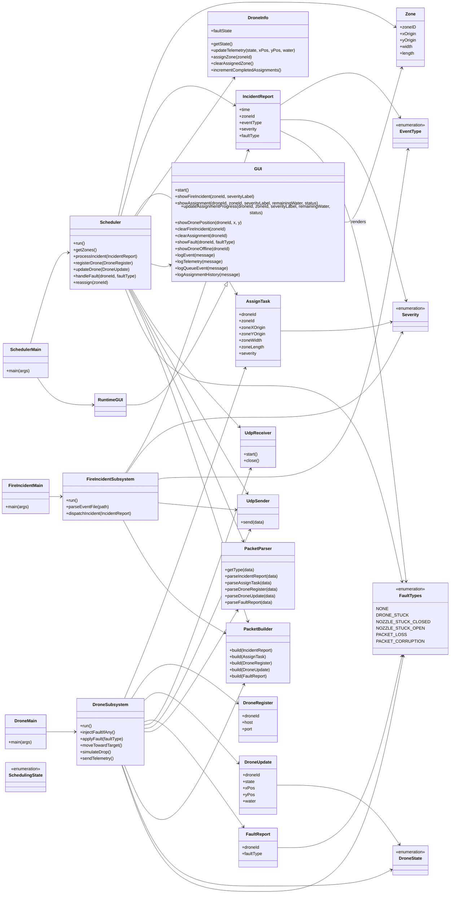
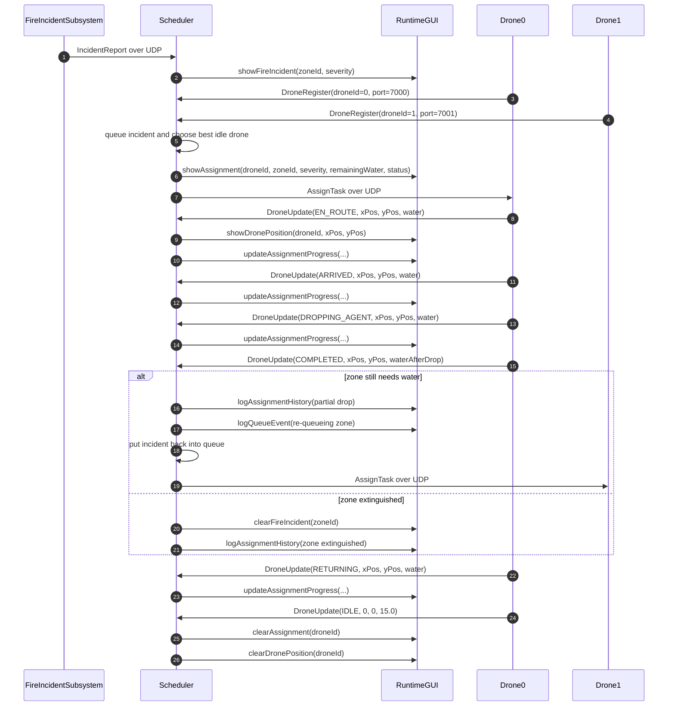
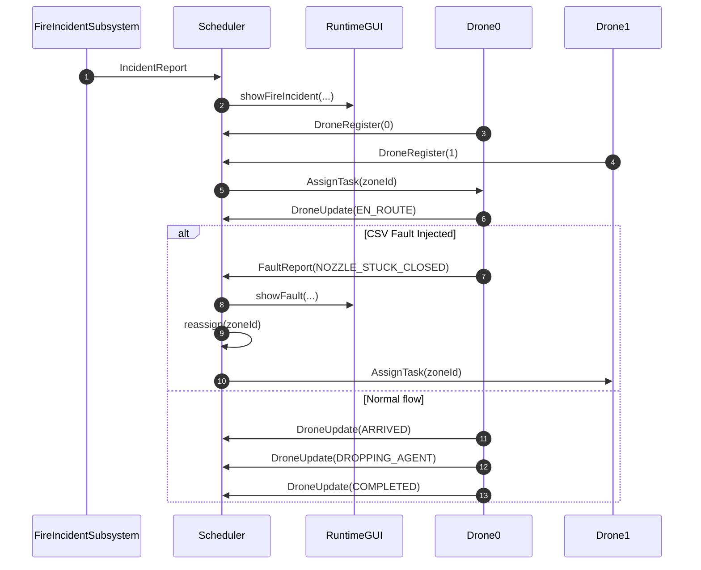
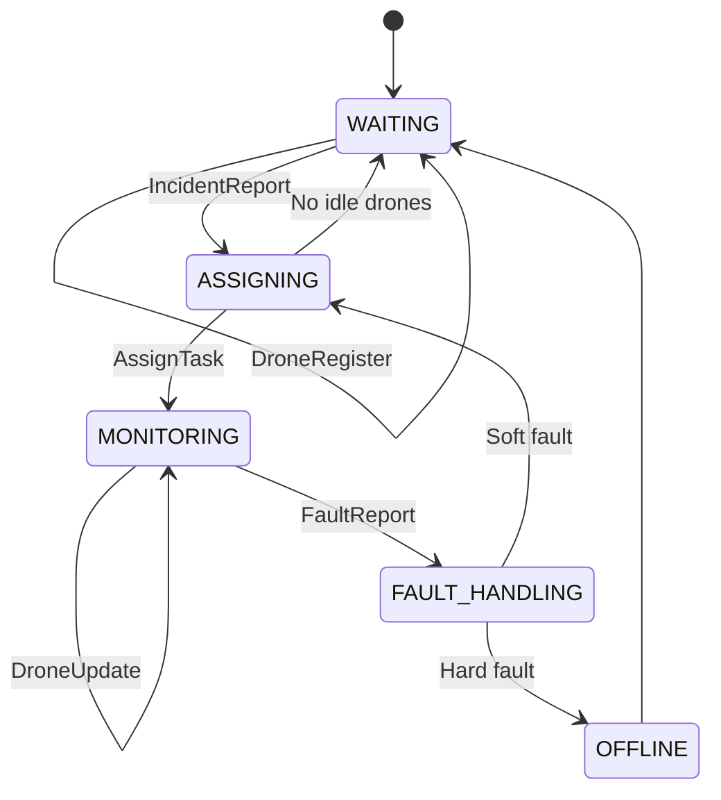
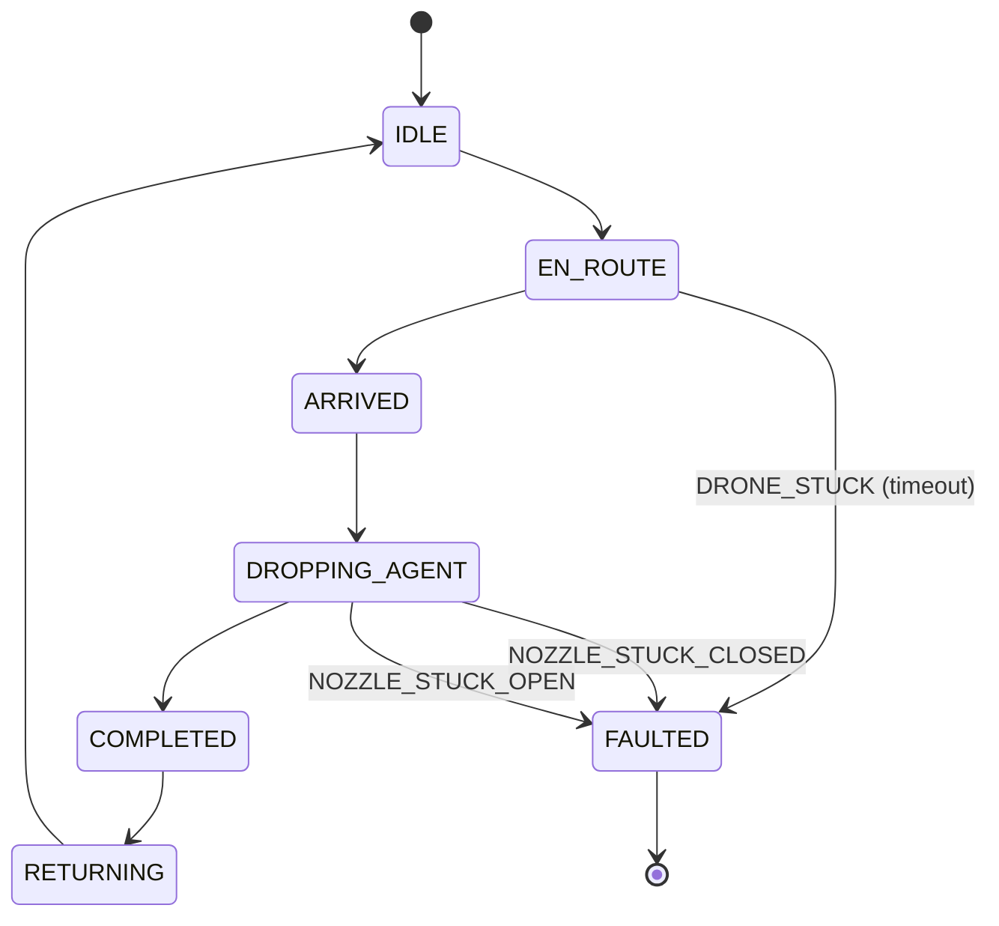
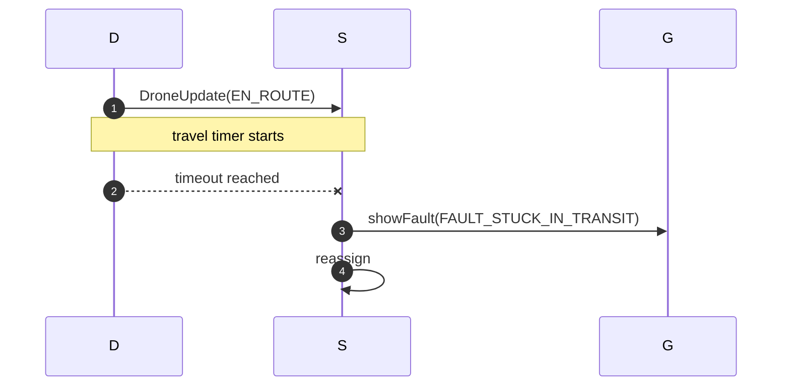
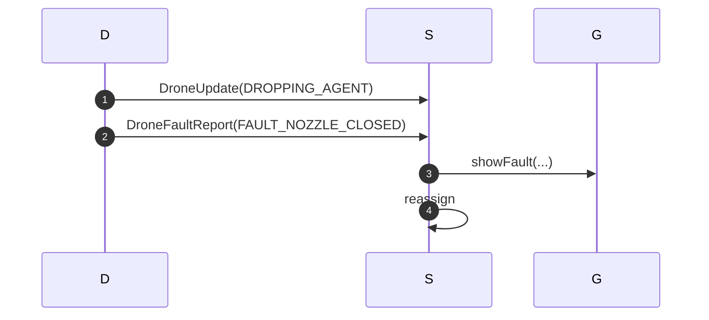
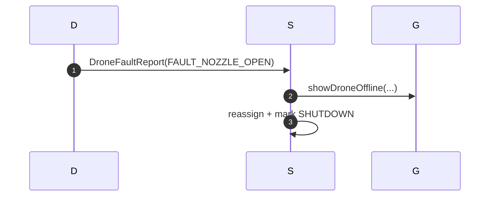
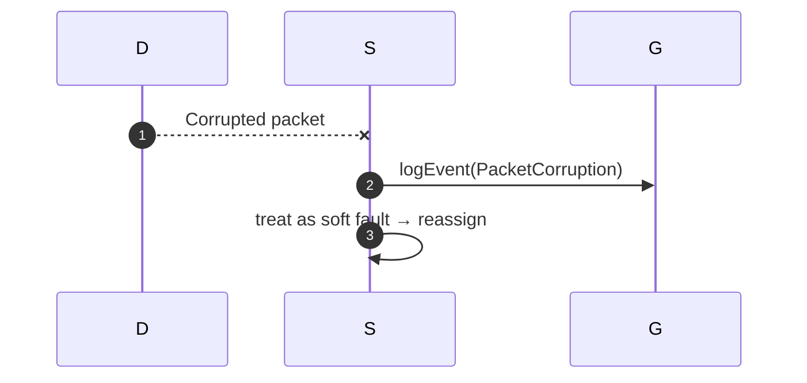

# FIREFIGHTING DRONE SWARM — Iteration 04
_Enhancement to Simulation — Fault Handling, Shutdown Logic, and Recovery_

Iteration 04 introduces:
- Fault injection through the event CSV fault column
- Fault state machine for drones (soft and hard faults)
- Travel timeout detection (`DRONE_STUCK`)
- Nozzle jam detection (`NOZZLE_STUCK_CLOSED`, `NOZZLE_STUCK_OPEN`)
- Hard-fault drone shutdown (`SHUTDOWN`)
- Scheduler-level reassignment
- GUI overlays for faults and offline drones
- Updated message types for error propagation
## Main files
### Entry points
- `DroneSwarmSim.scheduler.SchedulerMain`
- `DroneSwarmSim.fire.FireIncidentMain`
- `DroneSwarmSim.drone.DroneMain`
### Core subsystem files
- `Scheduler.java`
- `FaultTypes.java`
- `FireIncidentSubsystem.java`
- `DroneSubsystem.java`
### GUI files
- `GUI.java`
- `RuntimeGUI.java`
- `TileTypes.java`
### Models & Messages
- `Zone.java`, `Severity.java`, `Timer.java`
- **New**: `FaultReport.java`
### UDP Support
- `UdpEndpoint.java`, `UdpSender.java`, `UdpReceiver.java`
- `PacketBuilder.java`, `PacketParser.java`
## Input Files
### Updated CSV Format
Iteration 04 introduces a new `FaultType` column enabling scripted fault injection.
#### Column Template
`Time`, `ZoneId`, `EventType`, `Severity`, `FaultType`
#### Example CSV
```
Time,ZoneId,EventType,Severity,FaultType
14:03:15,3,FIRE_DETECTED,High,NOZZLE_STUCK_OPEN
14:07:00,1,FIRE_DETECTED,Moderate,NONE
14:09:22,2,DRONE_REQUEST,Low,DRONE_STUCK
14:10:00,1,DRONE_REQUEST,High,NOZZLE_STUCK_CLOSED
14:12:30,4,FIRE_DETECTED,Low,NONE
```
#### Allowed Values
- EventType: `FIRE_DETECTED`, `DRONE_REQUEST`
- Severity: `Low`, `Moderate`, `High`
- FaultType: `NONE`, `DRONE_STUCK`, `NOZZLE_STUCK_CLOSED`, `NOZZLE_STUCK_OPEN`, `PACKET_LOSS`, `PACKET_CORRUPTION`
## Diagrams
### UML Class Diagram

### Sequence Diagrams
#### Messeges SD

#### FAULT Handling SD

### State Machines
#### Scheduler SM

#### Drone SM

### Timing Diagrams
#### Travel Timeout → FAULT_STUCK_IN_TRANSIT

#### Nozzle Closed

#### Nozzle Open (Hard Fault)

#### Packet Corruption

## Running the System
### 1. Start the Scheduler
**Run**:
- **Main class**: `DroneSwarmSim.scheduler.SchedulerMain`
- **Optional**: zone file path
### 2. Start Drones
Run **each drone in its own process**:
- **Main class**: `DroneSwarmSim.drone.DroneMain`
- **Argument(s)**: drone ID (0,1,2...)
- **Port mapping**:
  - 0 → 7000
  - 1 → 7001
  - 2 → 7002
### 3. Start the Fire Incident Subsystem
- **Main class**: `DroneSwarmSim.fire.FireIncidentMain`
- **Optional**: event CSV path using the standard event format with an optional `Fault Type` column.
### Suggested Setups
#### Single-drone fault demo
1. Scheduler
2. DroneMain 0
3. FireIncidentMain with a regular event CSV whose `Fault Type` column injects the desired fault
#### Multi-drone demo
1. Scheduler
2. DroneMain 0, DroneMain 1
3. FireIncidentMain
## Team Contributions
| Team Member | Iteration 1–2 | Iteration 3 | Iteration 4 |
|-------------|----------------|-------------|-------------|
| **Pietro Adamvoski** | Fire Incident and Scheduler Subsystem. | Setup workflow, documentation, diagrams | Fault handling integration in the scheduler, Iteration 4 setup notes, and timing-diagram cleanup. |
| **Avery Robertson** | GUI, Drone Subsystem, communication between threads, and Iteration 02 UML and state machine diagrams. | Assignment/ Status UI, map + log views | GUI fault overlays, offline indicators, logs |
| **Adam Haddadin** | Iteration 01 UMLs, `README.txt`, initial test suites, and bug fixes. | UDP integration, test cleanup/ updates | Fault-handling test updates, packet parsing support, and verification pass on reassignment flows. |
| **Fareen Lavji** | V&V requirements + test suite packages + source code packages for Iteration 03, Iteration 02 `README.md`, and Iteration 03 UML and state machine diagrams. | Architecture Refactor + V&V Implementation, UDP upgrades/ integrations + full code sweep for javadocs/ test updates, `README.md` with mermaid diagrams + `vvChecklist.md` + `refactorPlan.md`, issue(s) tracking + bugs + merge conflicts → devops CI/CD pipeline on GitHub. | `iteration04_v&vPlan.md` + `README.md` with updates and required diagrams in mermaid script, issue tracking with TA's feedback from iteration 03 + outlined requirements for iteration 04 → GitHub issues for traceability, derived fault CSV specifications + fault logic implement. |
# Other Documentation
- `docs/iteration04/iteration04_v&vPlan.md`
- `docs/iteration03/README.md`
