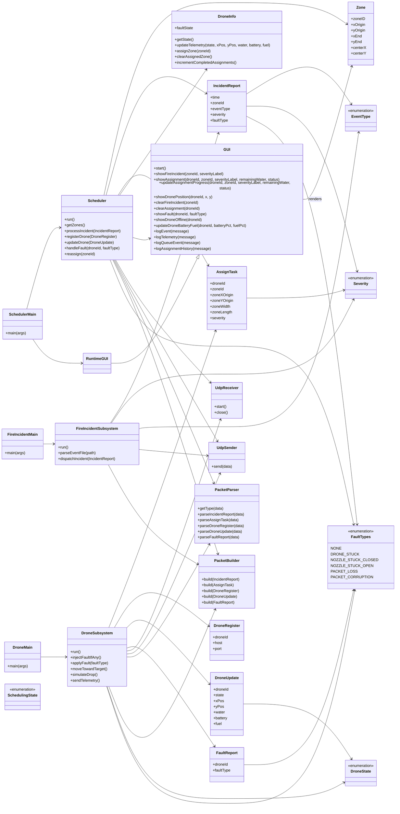
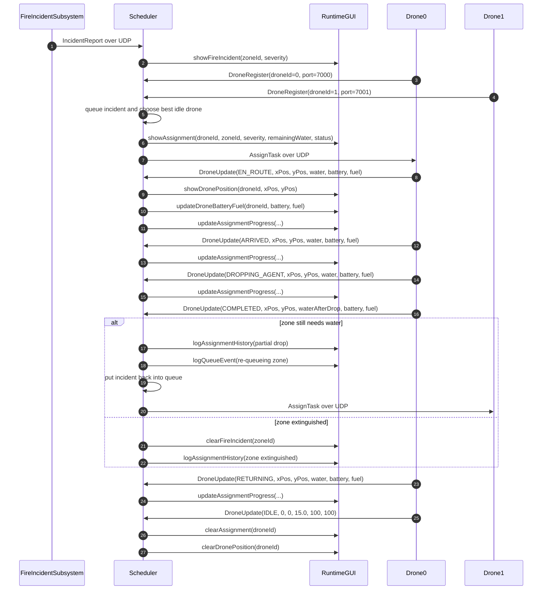
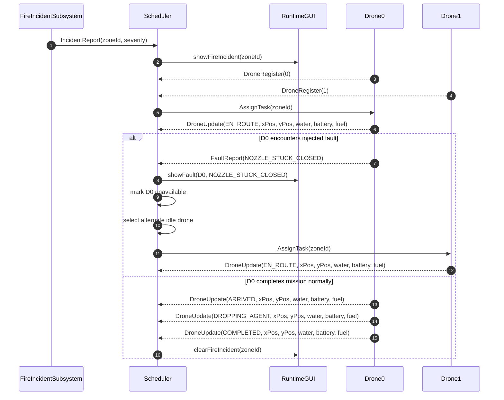
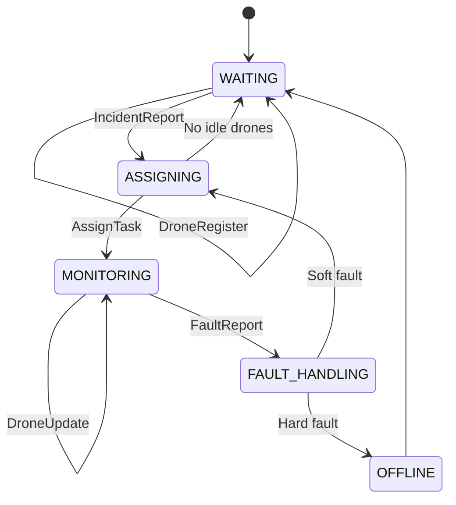
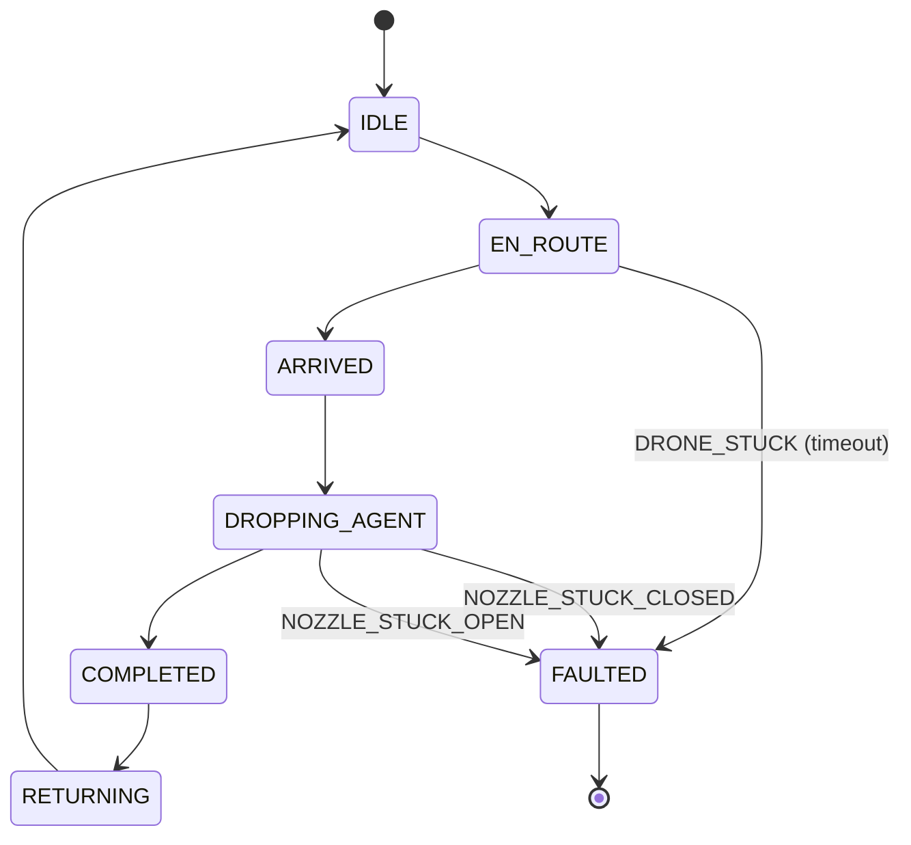

# FIREFIGHTING DRONE SWARM (RTCS – SIM)
_SYSC3303 – A3G6 • Winter 2026 • Dr. Sabouni, Rami • Carleton University (FED – SCE)_

## Table of Contents
- [1. Overview](#1-overview)
- [2. Features](#2-features)
- [3. System Architecture](#3-system-architecture)
  - [3.1 Components and Connectors (C&C)](#31-components-and-connectors-cc)
  - [3.2 Main Files](#32-main-files)
    - [3.2.1 Entry Points](#321-entry-points)
    - [3.2.2 Core Subsystem Files](#322-core-subsystem-files)
    - [3.2.3 GUI Files](#323-gui-files)
    - [3.2.4 Models & Messages](#324-models--messages)
    - [3.2.5 UDP Support](#325-udp-support)
  - [3.3 Input Files](#33-input-files)
    - [3.3.1 Updated CSV Format](#331-updated-csv-format)
    - [3.3.2 Column Template](#332-column-template)
    - [3.3.3 Example CSV](#333-example-csv)
    - [3.3.4 Allowed Values](#334-allowed-values)
  - [3.4 Diagrams](#34-diagrams)
    - [3.4.1 UML Class Diagram](#341-uml-class-diagram)
    - [3.4.2 Sequence Diagrams](#342-sequence-diagrams)
    - [3.4.3 State Machine Diagrams](#343-state-machine-diagrams)
    - [3.4.4 Timing Diagrams](#344-timing-diagrams)
  - [3.5 Design Summary](#35-design-summary)
    - [3.5.1 Iteration 02](#351-iteration-02)
    - [3.5.3 Iteration 03](#353-iteration-03)
    - [3.5.4 Iteration 04](#354-iteration-04)
    - [3.5.5 Iteration 05](#355-iteration-05)
- [4. Installation & Setup](#4-installation--setup)
  - [4.1 Requirements](#41-requirements)
  - [4.2 Getting the Project](#42-getting-the-project)
  - [4.3 Opening in IntelliJ](#43-opening-in-intellij)
  - [4.4 Building the Project](#44-building-the-project)
  - [4.5 Running the Simulation](#45-running-the-simulation)
  - [4.6 Input Files](#46-input-files)
    - [4.6.1 Event File (CSV)](#461-event-file-csv)
    - [4.6.2 Zone File (CSV)](#462-zone-file-csv)
  - [4.7 Configuration](#47-configuration)
- [5. System Behaviour](#5-system-behaviour)
  - [5.1 Fire Incident Subsystem](#51-fire-incident-subsystem)
  - [5.2 Scheduler](#52-scheduler)
  - [5.3 Drone Subsystem](#53-drone-subsystem)
- [6. Testing and V&V](#6-testing-and-vv)
  - [6.1 Unit Tests](#61-unit-tests)
  - [6.2 Integration Tests](#62-integration-tests)
  - [6.3 System Tests](#63-system-tests)
  - [6.4 Measurement Results](#64-measurement-results)
- [7. Team Contributions](#7-team-contributions)
- [8. Reflection](#8-reflection)

## 1. OVERVIEW
This Real-Time Control System (RTCS) simulates a firefighting drone swarm composed of three logical subsystems:
1. Scheduler
2. Drone Subsystem
3. Fire Incident Subsystem

The current codebase runs the Scheduler, Fire Incident subsystem, and Drone subsystem as separate UDP-connected Java processes. Drones register independently with the Scheduler, which dispatches work and keeps the runtime GUI updated.

### Team Members
- Pietro Adamvoski (101238885)
- Avery Robertson (101288279)
- Adam Haddadin (101308378)
- Fareen Lavji (xxxxxx543)

## 2. Features
- [x] Iteration 1: Basic message passing between subsystems using threaded communication.
- [x] Iteration 2: Core scheduling logic and complete drone state machine implementation.
- [x] Iteration 3: Multi‑drone support with distributed execution over UDP.
- [x] Iteration 4: Fault injection, detection, and automated fault handling.
- [x] Iteration 5: Full real‑time visualization, capacity limits, and system performance metrics.

## 3. System Architecture
### 3.1 Components and Connectors (C&C)
The current Iteration 5 source tree is organized under `src/main/java/DroneSwarmSim`, where each subsystem is isolated into its own top-level package and communicates over UDP:
```
DroneSwarmSim/        # Root package

  config/             # Runtime configuration classes
   │    ├── DroneConfig.java
   │    ├── FireIncidentConfig.java
   │    └── SchedulerConfig.java
   │
  drone/              # Drone Subsystem & drone state logic
   │    ├── DroneInfo.java
   │    ├── DroneMain.java
   │    ├── DroneState.java
   │    ├── DroneStatusUpdate.java
   │    ├── DroneSubsystem.java
   │    └── DroneTask.java
   │
     fire/               # Fire Incident Subsystem
   │    ├── FireIncident.java
   │    ├── FireIncidentMain.java
   │    ├── FireIncidentSubsystem.java
   │    └── EventType.java
   │
  messaging/          # Shared UDP message DTOs
   │    ├── Ack.java
   │    ├── AssignTask.java
   │    ├── DroneRegister.java
   │    ├── DroneUpdate.java
   │    ├── FaultReport.java
   │    ├── IncidentReport.java
   │    └── MessageType.java
   │
  model/              # Shared domain models & utilities
   │    ├── Severity.java
   │    ├── Timer.java
   │    └── Zone.java
   │
   net/udp/            # UDP transport and packet serialization
   │    ├── PacketBuilder.java
   │    ├── PacketParser.java
   │    ├── UdpEndpoint.java
   │    ├── UdpReceiver.java
   │    └── UdpSender.java
   │
  scheduler/          # Scheduler core + scheduling logic
   │    ├── FaultTypes.java
   │    ├── Scheduler.java
   │    ├── SchedulerMain.java
   │    ├── SchedulingState.java
   │    ├── SimulationLogger.java
   │    └── SimulationMetrics.java
   │
  ui/                 # User Interface components
   │    ├── GUI.java
   │    ├── RuntimeGUI.java
   │    └── TileTypes.java
```
### 3.2. Main files
#### 3.2.1 Entry points
- `DroneSwarmSim.scheduler.SchedulerMain`
- `DroneSwarmSim.fire.FireIncidentMain`
- `DroneSwarmSim.drone.DroneMain`
#### 3.2.2. Core subsystem files
- `Scheduler.java`
- `FaultTypes.java`
- `FireIncidentSubsystem.java`
- `DroneSubsystem.java`
#### 3.2.3. GUI files
- `GUI.java`
- `RuntimeGUI.java`
- `TileTypes.java`
#### 3.2.4. Models & Messages
- `Zone.java`, `Severity.java`, `Timer.java`
- `FaultReport.java`
#### 3.2.5. UDP Support
- `UdpEndpoint.java`, `UdpSender.java`, `UdpReceiver.java`
- `PacketBuilder.java`, `PacketParser.java`
### 3.3. Input Files
#### 3.3.1. Updated CSV Format
Iteration 4 added a `FaultType` column so fault scenarios can be scripted directly from the event file.
#### 3.3.2. Column Template
`Time`, `ZoneId`, `EventType`, `Severity`, `FaultType`
#### 3.3.3. Example CSV
```
Time,ZoneId,EventType,Severity,FaultType
14:03:15,3,FIRE_DETECTED,High,NOZZLE_STUCK_OPEN
14:07:00,1,FIRE_DETECTED,Moderate,NONE
14:09:22,2,DRONE_REQUEST,Low,DRONE_STUCK
14:10:00,1,DRONE_REQUEST,High,NOZZLE_STUCK_CLOSED
14:12:30,4,FIRE_DETECTED,Low,NONE
```
#### 3.3.4. Allowed Values
- EventType: `FIRE_DETECTED`, `DRONE_REQUEST`
- Severity: `Low`, `Moderate`, `High`
- FaultType: `NONE`, `DRONE_STUCK`, `NOZZLE_STUCK_CLOSED`, `NOZZLE_STUCK_OPEN`, `PACKET_LOSS`, `PACKET_CORRUPTION`
### 3.4 Diagrams
#### 3.4.1. UML Class Diagram

#### 3.4.2. Sequence Diagrams
##### 3.4.2.1. Messages Sequence Diagram

##### 3.4.2.2. Fault Handling Sequence Diagram

#### 3.4.3. State Machine Diagrams
##### 3.4.3.1. Scheduler State Machine

##### 3.4.3.2. Drone State Machine

#### 3.4.4. Timing Diagrams
##### 3.4.4.1. Normal Mission Timing

```mermaid
gantt
    title Single-drone mission timeline
    dateFormat  X
    axisFormat %Ls

    section Drone
    Receive assignment      :a1, 0, 1s
    Travel to zone          :a2, after a1, 6s
    Drop agent              :a3, after a2, 4s
    Return to base          :a4, after a3, 6s
    Refill / reset          :a5, after a4, 2s

    section Scheduler
    Queue and dispatch      :b1, 0, 1s
    Monitor telemetry       :b2, 1, 16s
    Mark fire extinguished  :b3, 11, 1s
```

##### 3.4.4.2. Fault and Reassignment Timing

```mermaid
gantt
    title Fault handling and reassignment timeline
    dateFormat  X
    axisFormat %Ls

    section Drone 0
    Receive assignment      :c1, 0, 1s
    Travel / partial work   :c2, after c1, 4s
    Fault report or timeout :c3, after c2, 1s

    section Scheduler
    Detect fault            :d1, 5, 1s
    Re-queue incident       :d2, after d1, 1s
    Dispatch replacement    :d3, after d2, 1s

    section Drone 1
    Travel to zone          :e1, 7, 6s
    Drop agent              :e2, after e1, 4s
    Return / refill         :e3, after e2, 8s
```

### 3.5. Design Summary
#### 3.5.1. Iteration 02
Iteration 2 expands the system from simple message‑passing to coordinated control:
- The Scheduler uses a state machine to receive incidents, assign tasks to drones, and handle faults.
- The Drone Subsystem executes missions through its own state machine, managing navigation, water dropping, refilling, and completion reporting.
- The Fire Incident Subsystem streams timed events into the system and receives acknowledgements after tasks are completed.
- Communication remains decoupled through dedicated channel classes, ensuring each subsystem can be tested in isolation.
- This architecture provides the groundwork required for multi‑drone coordination, distributed execution, and error handling in future iterations.
#### 3.5.3. Iteration 03
All inter-subsystem communication now occurs over UDP. The old thread-channel architecture from Iterations 1–2 has been replaced by packet-based communication between standalone main classes.
#### 3.5.4. Iteration 04
- Fault injection through the event CSV fault column
- Fault state machine for drones (soft and hard faults)
- Travel timeout detection (`DRONE_STUCK`)
- Nozzle jam detection (`NOZZLE_STUCK_CLOSED`, `NOZZLE_STUCK_OPEN`)
- Hard-fault drone shutdown (`SHUTDOWN`)
- Scheduler-level reassignment
- GUI overlays for faults and offline drones
- Updated message types for error propagation
#### 3.5.5. Iteration 05
- The runtime GUI grew into a proper monitoring dashboard. It now shows the live grid, fire state, fault overlays, per-drone selection, fleet status, elapsed time, and logs you can actually scroll through without being snapped back to the bottom.
- Telemetry now includes water, battery, and fuel, with assignment history and metrics shown in both the GUI and the scheduler logs.
- Drone capacity and refill behavior are enforced, and the scheduler tracks the numbers we care about for the demo: response time, completion time, queue depth, utilization, and total fleet distance.
- The demo setup is also simpler now. The `run-demo.sh` launcher prompts for the number of drones to start, defaults to 20 if left blank, and still supports manual single-drone startup through `DroneMain` when controlled testing is needed.

## 4. Installation & Setup
### 4.1. Requirements
- [x] Java 17 or later
- [ ] IntelliJ IDEA (recommended)
- [ ] Git (optional, for pulling updates)
### 4.2. Getting the Project
Clone or download the repository:
```Shell
git clone <your-repo-url>
cd <project-folder>
```
_Or download the ZIP and extract it._
### 4.3. Opening in IntelliJ
1. Open IntelliJ IDEA
2. Select `File` → `Open`
3. Choose the project root folder
4. Allow IntelliJ to index and load dependencies
### 4.4. Building the Project
If using IntelliJ, the project builds automatically.
Using the terminal (Maven):
```Shell
mvn clean compile
```
### 4.5. Running the Simulation
1. The easiest way to run the demo is `./run-demo.sh` from the repository root. It compiles the project, starts the Scheduler, prompts for how many drones to launch, starts the Fire Incident subsystem, and cleans up stale background processes when you stop it. If you leave the prompt blank, it defaults to 20 drones.
2. Manual startup order:
   - Start `DroneSwarmSim.scheduler.SchedulerMain` to launch the Scheduler and runtime GUI.
   - Start `DroneSwarmSim.drone.DroneMain`.
   - Start `DroneSwarmSim.fire.FireIncidentMain` to stream incidents from the configured CSV file.
3. `DroneSwarmSim.drone.DroneMain` behavior:
   - With no args, it starts the default fleet of 20 drones.
   - With `-Dexec.args="<droneId>"`, it starts only that drone.
4. `run-demo.sh` launcher behavior:
   - If you enter `5`, it launches drones `0` through `4`.
   - If you enter `1`, it launches only drone `0`.
   - If you leave the prompt blank, it launches the default fleet of 20 drones.
5. Example manual commands:
```Shell
mvn exec:java -Dexec.mainClass="DroneSwarmSim.scheduler.SchedulerMain"
mvn exec:java -Dexec.mainClass="DroneSwarmSim.drone.DroneMain"
mvn exec:java -Dexec.mainClass="DroneSwarmSim.drone.DroneMain" -Dexec.args="3"
mvn exec:java -Dexec.mainClass="DroneSwarmSim.fire.FireIncidentMain"
```
6. Optional: pass a custom zone CSV path to `DroneSwarmSim.scheduler.SchedulerMain` or a custom event CSV path to `DroneSwarmSim.fire.FireIncidentMain`.
## 4.6. Input Files
The simulation uses two input files to drive events and define the environment.
### 4.6.1. Event File (CSV)
Each line represents a time-stamped event: `hh:mm:ss.mmm, zoneId, FIRE_DETECTED | DRONE_REQUEST, Low | Moderate | High, FaultType`<br>
Example: `14:00:00.300, 2, FIRE_DETECTED, Moderate, NOZZLE_STUCK_CLOSED`
### 4.6.2. Zone File (CSV)
Each zone is defined by its start and end coordinates: `zoneId, (x1;y1), (x2;y2)`<br>
Example: `3, (1800;0), (2700;900)`<br>
Severity values map to the amount of water required.
### 4.7. Configuration
Most simulation parameters still live in code constants or the input files:
- Default fleet size (`DroneConfig.NUM_DRONES`, currently 20)
- Number of zones
- Travel time between zones
- Agent drop time
- Nozzle open/close time
- Initial agent capacity per drone
- Battery drain and fuel usage constants
- Paths to event and zone input files
- UDP ports per subsystem
- Per‑drone task/status sockets
- Fault injection options

## 5. System Behaviour
The system follows a modular, message‑driven model in which each subsystem executes independently.
### 5.1. Fire Incident Subsystem
1. Reads and parses fire events from the input file
2. Publishes incidents to the Scheduler over the report channel
3. Receives acknowledgements after drone completion
### 5.2. Scheduler
1. Maintains the incident queue
2. Assigns tasks to available drones following scheduling rules
3. Forwards incidents and receives drone updates
4. Handles faults (Iteration 2 foundational logic in place)
### 5.3. Drone Subsystem
1. Executes a state machine: Idle → En Route → Arrived → Dropping Agent → Returning → Refilling → Idle
2. Reports status, resource usage, and completion back to the Scheduler
3. Applies water, battery, and fuel consumption rules during travel and drop operations

## 6. Testing and V&V
Automated verification is performed with JUnit 5 via `mvn test`. The current suite contains **98 tests across 23 classes** and passes with **0 failures** and **0 skipped** tests.
### 6.1. Unit Tests
- The unit suite covers the main code paths in the current implementation:
- Scheduler logic: `SchedulerQueueOrderTest`, `SchedulerLoadBalancingTest`, `SchedulerSelectionTest`, `SchedulerTest`, `FaultHandlingTest`, `ZoneCsvParserTest`
- Drone logic: `DroneStateMachineTest`, `DroneCapacityRefillTest`, `DroneFaultRecoveryTest`, `DroneStatusMetricsTest`
- Fire incident handling: `FireIncidentSubsystemTest`
- UDP / message utilities: `PacketRoundTripTest`, `PacketParserTest`, `MessageContractsIT`, `UdpLoopbackIT`
- Shared model / DTO / GUI support: `SeverityMappingTest`, `TimerTest`, `IncidentReportDtoTest`, `GUITest`
### 6.2. Integration Tests
Integration tests verify end-to-end behaviour across the major subsystems, including:
- mission lifecycle from incident arrival to drone completion (`MissionLifecycleTest`)
- multi-incident queue draining and balanced load distribution (`MultiIncidentQueueDrainIT`)
- two-drone end-to-end mission flow (`TwoDronesBasicFlowIT`)
- fault injection, timeout handling, and reassignment (`FaultHandlingTest`)
- queued-task processing while a drone is busy (`DroneStatusMetricsTest.droneQueuesMultipleTasks`)
- least-loaded drone selection (`SchedulerLoadBalancingTest.testLoadBalancingPrefersLeastLoadedDrone`)
- path-through redirection (`SchedulerLoadBalancingTest.testPathThroughRedirect`)
### 6.3. Manual / System Validation
Display-dependent GUI/system scenarios are validated manually. Runtime logs and metrics are written to the `logs/` directory, and `Scheduler.printMetricsSummary()` writes the final metrics summary to stdout and to `logs/metrics.log`.

**Note**: _Further V&V information is summarized in the [`final_vv_report.pdf`](./final_vv_report.pdf) document._

### 6.4. Measurement Results
The system records runtime measurements through `SimulationMetrics`, and the summaries are written to `logs/metrics.log`. The values below were taken from a full end-to-end demo run using the default final input files:

- Event file: `src/Final_event_file_w26.csv`
- Zone file: `src/Final_zone_file_w26.csv`
- Fleet size: 20 drones launched through the default `run-demo.sh` flow

These numbers are not meant to be treated as hard real-time guarantees. They are measured results from the current implementation running on a single machine over `localhost`.

| Scenario | Source | Key Results |
|----------|--------|-------------|
| Full 20-drone run using the final event and zone files | `logs/metrics.log` summary at `15:51:49.945` | Total duration `591.24 s`; fires reported/extinguished `22 / 22`; service requests `28`; total drone trips `82`; total faults `0`; average response time `6.74 s`; max response time `12.74 s`; average completion time `19.07 s`; max completion time `29.61 s`; average queue length `0.50`; max queue length `1`; total fleet distance `291910.7` units. |

For that full run, the per-fire breakdown in `logs/metrics.log` recorded these arrival and extinguish times:

Arrival time means the time from when an incident is reported to when the first assigned drone reaches that zone. Extinguish time means the time from when the incident is reported to when the fire is fully out. For low-severity fires, those numbers are usually fairly close. For moderate and high fires, the gap is larger because the total includes travel, drop time, and sometimes a follow-up drone if one drop is not enough.

| Zone | Arrival Time | Extinguish Time |
|------|--------------|-----------------|
| 2 @ `00:03:32` | `6.81 s` | `10.81 s` |
| 3 @ `00:16:16` | `5.32 s` | `18.64 s` |
| 4 @ `00:17:21` | `10.70 s` | `26.87 s` |
| 5 @ `01:24:54` | `8.88 s` | `12.88 s` |
| 4 @ `01:48:35` | `8.18 s` | `28.65 s` |
| 5 @ `01:57:35` | `12.74 s` | `29.61 s` |
| 2 @ `01:59:24` | `5.52 s` | `20.29 s` |
| 2 @ `02:30:12` | `6.77 s` | `10.77 s` |
| 3 @ `02:31:45` | `5.31 s` | `18.63 s` |
| 5 @ `03:05:49` | `8.88 s` | `25.75 s` |
| 3 @ `03:50:25` | `5.31 s` | `18.63 s` |
| 1 @ `03:50:48` | `2.50 s` | `6.50 s` |
| 2 @ `04:05:19` | `6.77 s` | `21.54 s` |
| 4 @ `04:57:36` | `8.17 s` | `24.34 s` |
| 3 @ `04:57:50` | `5.53 s` | `18.85 s` |
| 2 @ `05:06:30` | `6.77 s` | `10.77 s` |
| 1 @ `05:21:49` | `2.46 s` | `12.91 s` |
| 4 @ `05:54:55` | `8.17 s` | `24.34 s` |
| 1 @ `06:21:16` | `2.46 s` | `12.92 s` |
| 3 @ `06:23:01` | `5.32 s` | `18.63 s` |
| 5 @ `06:44:30` | `8.87 s` | `25.75 s` |
| 2 @ `06:54:24` | `6.77 s` | `21.53 s` |

These numbers match what we saw during the full run. Low-severity incidents are generally cleared faster, while the longer completion times come from the larger fires that need more travel time or more than one drop. The queue measurements also stayed low across the run, which is what we wanted from the scheduler.

Refer to the [V&V Report](https://github.com/Averrryyy/Winter2026Sysc3303FinalProjectGroup6/blob/967d4dd28adc7fe0a7a51a219d07ae95fdbaadb7/archive/iteration05/iteration05_vvReport.md) for more details.

## 7. Team Contributions
| Team Member          | Iteration 1–2                                                                                                                                              | Iteration 3                                                                                                                                                                                                                                                                  | Iteration 4                                                                                                                                                                                                                                                                           | Iteration 5                                                                                                                                                                                                 |
|----------------------|------------------------------------------------------------------------------------------------------------------------------------------------------------|------------------------------------------------------------------------------------------------------------------------------------------------------------------------------------------------------------------------------------------------------------------------------|---------------------------------------------------------------------------------------------------------------------------------------------------------------------------------------------------------------------------------------------------------------------------------------|-------------------------------------------------------------------------------------------------------------------------------------------------------------------------------------------------------------|
| **Pietro Adamvoski (101238885)** | Fire Incident and Scheduler Subsystem.                                                                                                                     | Setup workflow, documentation, diagrams                                                                                                                                                                                                                                      | Fault handling integration in the scheduler, Iteration 4 setup notes, and timing-diagram cleanup.                                                                                                                                                                                     | Final GUI usability fixes, demo workflow cleanup, default 20-drone launch, merge/rebase conflict resolution, and final integration pass after syncing with `main`.                                         |
| **Avery Robertson (101288279)**  | GUI, Drone Subsystem, communication between threads, and Iteration 02 UML and state machine diagrams.                                                      | Assignment/ Status UI, map + log views                                                                                                                                                                                                                                       | GUI fault overlays, offline indicators, logs                                                                                                                                                                                                                                          | Runtime GUI dashboard polish, live visualization support, per-drone status display, and grid rendering updates for telemetry, fire state, and assignments.                                                 |
| **Adam Haddadin (101308378)**    | Iteration 01 UMLs, `README.txt`, initial test suites, and bug fixes.                                                                                       | UDP integration, test cleanup/ updates                                                                                                                                                                                                                                       | Fault-handling test updates, packet parsing support, and verification pass on reassignment flows.                                                                                                                                                                                     | Timing diagrams, verification support, and final review of scheduler/drone behavior under the Iteration 5 visualization and metrics requirements.                                                          |
| **Fareen Lavji (xxxxxx543)**     | V&V requirements + test suite packages + source code packages for Iteration 03, Iteration 02 `README.md`, and Iteration 03 UML and state machine diagrams. | Architecture Refactor + V&V Implementation, UDP upgrades/ integrations + full code sweep for javadocs/ test updates, `README.md` with mermaid diagrams + `vvChecklist.md` + `refactorPlan.md`, issue(s) tracking + bugs + merge conflicts → devops CI/CD pipeline on GitHub. | `iteration04_v&vPlan.md` + `README.md` with updates and required diagrams in mermaid script, issue tracking with TA's feedback from iteration 03 + outlined requirements for iteration 04 → GitHub issues for traceability, derived fault CSV specifications + fault logic implement. | Implemented logic for telemetry, metrics, and other logs; refined scheduler; refactor and cleanup; drafted final `README.md`, `README.pdf`, `iteration05_vvReport`, and report; final V&V before submission. | 

## 8. Reflection
The part of the project we are proudest of is the GUI. We spent a lot of time on it. By the end, the system had moved well past a basic grid with a few status labels. The live map, assignment panel, logs, fault indicators, fleet information, and per-drone telemetry made the simulation much easier to understand while it was running. That mattered more and more once the number of drones increased and faults started happening in the middle of active missions.

One thing we did not fully implement was true redirection logic in the sense of resource-aware retasking. For example, if a drone used 10 L to extinguish a LOW fire and still had 5 L left, an ideal version of the system could send that drone to contribute the remaining 5 L to another nearby fire before returning to base. We talked about that idea a lot, but it turned out to be much harder than it looked because it touches scheduling, mission state, remaining-water tracking, and GUI synchronization all at once. Given the time we had, we decided it was better to keep that behavior conservative and stable instead of forcing in a half-working version.

If we were redoing part of the design, it would be the way mission timing and fire ownership are represented internally. Once partial drops, reassignment timing, faults, queueing, and GUI updates all started interacting, a lot of the late debugging effort came from keeping those pieces synchronized. A cleaner incident lifecycle model would have made the system easier to reason about and easier to test.

We were also never fully convinced by the way the "fastest drone" style comparison could be interpreted. In a simulation like this, raw speed can be changed by tuning constants rather than improving the underlying design. For example, we could reduce the drone movement update interval, shorten the water drop duration, shorten refill time, or compress the event playback timing. All of those changes would make the simulation look faster and improve the reported timings, even though they would not necessarily reflect a better scheduling strategy or a better system overall. That made the competition aspect feel a little unclear to us, since a team could end up optimizing constants rather than architecture.

Overall, we are happy with where the project landed by Iteration 5. The final system shows separate communicating processes, live visualization, fault handling, telemetry, and measurable performance. It is not perfect, but it is much closer to a real control-system simulation than what we had at the beginning.
